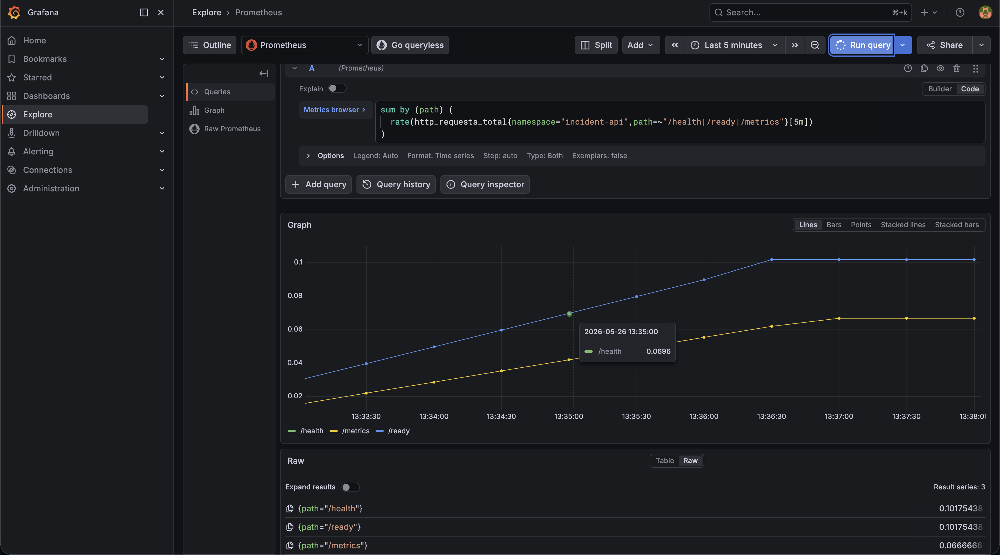

# Architecture

## Overview

This project demonstrates an ephemeral AWS EKS golden path for deploying a small FastAPI application with Terraform, Docker, ECR, Helm, Kubernetes, GitHub Actions, and GitHub OIDC.

The goal is to show a complete platform workflow:

```text
Application code
→ Docker image
→ ECR registry
→ Helm deployment
→ EKS runtime
→ Health validation
→ Terraform destroy
```

## High-level architecture

```text
Developer laptop
  |
  | Terraform CLI
  v
Terraform S3 remote backend
  |
  | provision AWS resources
  v
AWS infrastructure
  |
  | ECR image pull / Helm deployment
  v
Amazon EKS
  |
  ├── incident-api namespace
  |     |
  |     ├── FastAPI Incident API
  |     ├── ClusterIP Service
  |     └── ServiceMonitor
  |
  └── observability namespace
        |
        ├── Prometheus Operator
        ├── Prometheus
        ├── Grafana
        ├── kube-state-metrics
        └── node-exporter
```

## Terraform backend architecture

The project uses a separated bootstrap stack:

```text
terraform/bootstrap/backend
```

This stack creates the S3 backend used by the main Terraform environment.

```text
bootstrap/backend
  |
  | creates
  v
S3 bucket
  |
  | stores state for
  v
terraform/environments/dev
```

## Remote state

Terraform state is stored remotely in S3:

```text
S3 bucket
→ terraform.tfstate
```

The bucket is configured with:

```text
versioning enabled
server-side encryption enabled
public access blocked
```

## State locking

The backend uses native S3 locking:

```hcl
use_lockfile = true
```

This means S3 is used for both:

```text
state storage
state lockfile
```

DynamoDB is intentionally not used for locking because the older `dynamodb_table` backend parameter is deprecated.

## Infrastructure layer

Terraform provisions the AWS foundation:

```text
VPC
Public subnets
Internet Gateway
EKS cluster
Managed node group
ECR repository
IAM roles
EKS access entries
GitHub OIDC provider
GitHub Actions ECR push role
```

The first version avoids NAT Gateway to reduce cost and keep the lab suitable for short-lived demonstrations.

## CI/CD layer

GitHub Actions validates the project through automatic workflows:

```text
Python CI   → pytest
Docker CI   → docker build
Platform CI → Helm lint/template + Terraform fmt/init/validate
```

AWS-related workflows are manual:

```text
OIDC Smoke Test → validates AWS role assumption through OIDC
ECR Push        → builds and pushes the Docker image to ECR through OIDC
```

This avoids cloud side effects on every push.

## Application observability layer

The FastAPI application exposes a Prometheus-compatible endpoint:

```text
GET /metrics
```

The endpoint exposes Prometheus metrics generated by `prometheus-client`:

```text
incident_api_info{app="incident-api",version="0.1.0"} 1.0
http_requests_total{method="GET",path="/health",status_code="200"} 1.0
```

A FastAPI middleware increments `http_requests_total` for each HTTP request, using method, path, and status code labels.

The Helm chart injects Prometheus scrape annotations into the Kubernetes pod template:

```yaml
prometheus.io/scrape: "true"
prometheus.io/path: "/metrics"
prometheus.io/port: "8000"
```

The chart also supports an optional `ServiceMonitor` for Prometheus Operator discovery. The `ServiceMonitor` is disabled by default so the application can deploy without Prometheus CRDs installed.

For V2 observability validation, the application is deployed in the `incident-api` namespace with `ServiceMonitor` enabled through a dedicated values file:

```text
observability/incident-api-observability-values.yaml
```

The observability stack is deployed in the `observability` namespace with `kube-prometheus-stack`.

Validated data path:

```text
FastAPI /metrics
→ ServiceMonitor
→ Prometheus scrape
→ PromQL query
→ Grafana Explore
```

Grafana validation:



## Design choices

| Decision | Reason |
|---|---|
| EKS instead of local Kubernetes only | Demonstrates real managed Kubernetes operations on AWS |
| ECR instead of Docker Hub | Native AWS IAM integration and private registry workflow |
| Helm instead of raw manifests | Reusable and configurable Kubernetes deployment |
| Terraform modules | Reusable infrastructure boundaries |
| Separate backend bootstrap stack | Avoids creating the backend inside the state it stores |
| S3 remote state | Keeps Terraform state outside the local machine |
| S3 native lockfile | Provides locking without DynamoDB |
| No NAT Gateway in V1 | Lower cost for an ephemeral lab |
| Port-forward validation | Avoids LoadBalancer cost in the first version |
| Manual AWS workflows | Prevents accidental AWS changes on every push |
| prometheus-client for application metrics | Provides Prometheus-compatible metrics from the FastAPI application |
| Optional ServiceMonitor | Allows Prometheus Operator discovery while keeping the chart deployable without CRDs |
| kube-prometheus-stack for V2 | Provides Prometheus, Grafana, exporters, and Prometheus Operator using a standard Helm stack |
| Dedicated namespaces | Separates application workloads from platform observability tooling |

## Current limitations

- No production ingress yet
- No HTTPS termination yet
- Grafana and Prometheus are accessed through port-forward only
- No automated EKS deployment from CI yet
- No frontend application yet
- No protected GitHub environment approval gates yet
